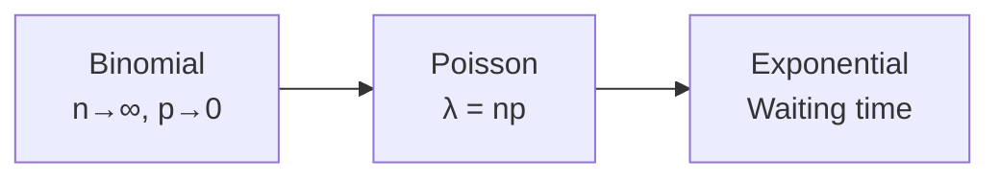

# Session Rulebook — The Documentary Style

> A permanent reference for constructing every future session.
> Read this before writing any new session. Follow it strictly.

---

## 1. The Core Philosophy

Every session must be a **documentary**, not a textbook chapter.

A textbook: *"The Binomial distribution has PMF $\binom{n}{k}p^k(1-p)^{n-k}$ with mean $np$ and variance $np(1-p)$."*

A documentary: *"You flip a biased coin n times. Each flip is Bernoulli. The total heads is the sum. Let's build the probability from the ground up — first one sequence, then all sequences, then the mean, then the variance. Here's why each formula looks the way it does."*

**Rule:** Never state a formula without deriving it from something simpler. Never derive without explaining *why* each step works.

---

## 2. Chapter Template

Every chapter must follow this structure:

```
## Chapter N: [Evocative Title] — [Subtitle]

### Narrative Hook
- Opens with a problem or question that this chapter will solve
- "What if we could..." / "The problem with..." / "Imagine..."
- Connects to previous chapters: "In Chapter N-1 we learned X. But what about Y?"

### The Setup
- Define the scenario
- Introduce notation
- Build the intuition before the math

### Step-by-Step Derivation
- Break into labeled steps: "Step 1: ...", "Step 2: ..."
- Every algebraic manipulation SHOWN (not "simplifying gives")
- Use numerical examples alongside algebraic steps
- ✅ verification markers after each check

### The Formula
- Box the final result: $$\boxed{formula}$$
- But wait! Before moving on...

### "Let's Understand This Formula"
- A dedicated section after EVERY derived formula
- Ask: What does this tell us? When is it zero? Maximum? Minimum?
- Test extreme values: p=0, p=1, n→∞, etc.
- Connect to intuition: "If p=0.5, variance is maximal because..."

### Numerical Verification
- Test on a concrete example
- Show the numbers work out
- ✅

### Real-World Connection
- Where does this appear in practice?
- Why should the reader care?

### Bridge to Next Section
- Last sentence points forward: "This is the foundation for..."
- OR: "Now that we understand X, what about the related question Y?"
```

---

## 3. Stylistic Checklist

Every session must check ALL of these:

- [ ] **Narrative hook** at chapter start (problem first, solution second)
- [ ] **Self-dialogue moments** ("Wait, let me check...", "This sounds weird but...", "Let me be careful here")
- [ ] **Full algebra** — every common denominator, every factorization, every cancellation shown line by line
- [ ] **Multiple methods** for key derivations (e.g., mean via definition AND via linearity)
- [ ] **Numerical verification** after every formula (test on concrete values)
- [ ] **"Let's understand this formula"** section after every derived result
- [ ] **✅ markers** to verify correctness
- [ ] **Bridge sentences** connecting chapters and previous sessions
- [ ] **Real-world analogies** woven into derivations (not just listed at end)
- [ ] **Extreme case testing** (what happens at boundaries?)
- [ ] **Table summaries** when comparing multiple distributions
- [ ] **Practice problems** with full theoretical explanations in callouts (even if few)

### Tone Markers
- Use phrases like: "Here's the key insight:", "The magic happens when:", "Let me show you why:"
- Address the reader directly: "You might wonder why..."
- Use conversational but precise language
- No monotone "Definition → Property → Theorem → Proof" flow

---

## 4. Mathematical Derivation Standards

### Algebra Must Show

**DO:**
```
Var(X) = (n+1)(2n+1)/6 - ((n+1)/2)²
= (n+1)(2n+1)/6 - (n+1)²/4
= (n+1)[(2n+1)/6 - (n+1)/4]
= (n+1)[2(2n+1)/12 - 3(n+1)/12]
= (n+1)[(4n+2 - 3n - 3)/12]
= (n+1)[(n-1)/12]
```

**DON'T:**
```
Var(X) = (n+1)(2n+1)/6 - ((n+1)/2)²
= (n²-1)/12
```

### Limit Steps Must Show

**DO:**
```
Factor B = (1 - λ/n)^n
We know: e^x = lim_{n→∞} (1 + x/n)^n
So with x = -λ: (1 - λ/n)^n → e^{-λ}

Numerical check for λ=2:
n=10:  (0.8)^10 ≈ 0.107
n=100: (0.98)^100 ≈ 0.133
n=1000: (0.998)^1000 ≈ 0.135
e^{-2} ≈ 0.1353 ← converging
```

### Integration Steps Must Show
- Set up u and dv clearly for integration by parts
- Show boundary term evaluation
- Show remaining integral computation
- Verify final result

### Series Manipulations Must Show
- Show index shifts (k → k-1 → j)
- Show factorial cancellations
- Show why the remaining sum equals a known series

---

## 5. Blueprint Process for New Sessions

Before writing ANY session, follow this process:

### Step A: Read the last session
- Understand the current narrative state
- Identify what topics come next naturally
- Note what bridges need to connect

### Step B: Write a Blueprint (plan mode)
1. List every chapter with its narrative hook
2. Within each chapter, list every Part with its derivation
3. Note which derivations need "two methods" treatment
4. Plan real-world examples for each chapter
5. Plan numerical verification points
6. Plan bridge sentences between chapters

### Step C: Present blueprint for review
- User reviews and approves

### Step D: Expand to full session (build mode)
- Expand each bullet into full documentary narrative
- Follow the Chapter Template from Section 2
- Run the Stylistic Checklist from Section 3
- Every algebraic step must be written out

---

## 6. Visuals & Language Rules

### Rule 1: Use Visuals Whenever Possible

Abstract concepts must be accompanied by a visual. Preferred visual types (in order):

**ASCII/Unicode bar charts** (always works, no dependencies):
````
λ = 1:   0: ████████████████████ (37%)
          1: ████████████████████ (37%)
          2: ████████            (18%)
          3: ███                 (6%)
          4: ▏                   (1.5%)
          rest: tiny

→ Looks like a slide: huge left bar, long skinny tail to the right
````

**Mermaid diagrams** for relationships, flow, connections:


**Tables with visual comparison columns**:
| λ | Mean | Spread (σ) | Spread/Mean | Shape |
|---|------|------------|-------------|-------|
| 1 | 1 | 1 | 100% | Very lopsided ← |
| 4 | 4 | 2 | 50% | Somewhat lopsided |
| 16 | 16 | 4 | 25% | Starting to look symmetric |
| 100 | 100 | 10 | 10% | Almost bell-shaped |

**Mermaid xyChart** (when available) for distribution comparisons.

### Rule 2: Use Simple Language — No Bookish/Academic Tone

**Talk like you're explaining the plot of a movie to a friend.**
Not like you're writing a research paper.

#### ❌ Academic / Bookish (DON'T)
> "If events arrive at a Poisson rate λ, then the waiting time between events follows an Exponential distribution with parameter λ."

> "This ensures the total area under the curve equals 1. The σ in the denominator accounts for the spread."

> "The coefficient of variation equals 1, indicating the spread is as large as the mean."

#### ✅ Conversational / Narrative (DO)
> "So here's the situation. Buses arrive at some rate. You're standing at the stop. How long will you wait? That's what Exponential tells you. And here's the neat part: if λ is the rate, your waiting time is Exponential(λ). Simple as that."

> "Think about it this way. If the bell is wider, it needs to be shorter, so the total area still equals 1. That's all the σ in the denominator does — it adjusts the height to match the width."

> "The standard deviation is the same as the mean. That's huge. It means: if the average wait is 5 minutes, then waiting 10 minutes is totally normal. You can't say that about most distributions."

#### Simple Language Toolkit

| Instead of this | Say this |
|----------------|----------|
| "We define X as..." | "Here's what X means..." |
| "It can be shown that..." | "Here's why this works..." |
| "This is called the..." | "We call this the... — here's why the name fits" |
| "Consequently..." | "So..." / "Which means..." |
| "Utilizing the property..." | "Using this trick..." |
| "The following holds true..." | "Check this out..." |
| "Parameter λ" | "λ (the rate)" |
| "X follows a distribution..." | "X is a [Normal/Poisson/Exponential] — here's what that means: ..." |
| Passive voice everywhere | Active voice. "You transform X." Not "X is transformed." |

#### The Test

Before writing any section, ask yourself: **"Would I explain it this way to a friend over chai?"**

If the answer is no, rewrite it.

A friend explaining doesn't say "the Poisson distribution converges to Normality as λ increases." They say:
> "Look at what happens when λ gets bigger. When λ is small, the bars are all bunched up on the left. When λ is big, the bars spread out and look like a bell. It just naturally smooths out."

#### Specific patterns to maintain

1. **Set up a scene.** Don't state a fact. Paint a picture.
   - ❌ "The Exponential distribution models waiting time."
   - ✅ "You're standing at a bus stop. How long until the bus comes? That's the Exponential."

2. **One idea per sentence.** Short sentences. Periods, not commas.

3. **Use "you" and "we".** Make the reader part of the story.
   - "You want to find P(X > 130). Here's how." 
   - "We start from the Binomial PMF."

4. **Show the thinking process.** Don't just state results.
   - ❌ "The integral equals 1/λ."
   - ✅ "Now we need to evaluate this integral. Let's use integration by parts. Set u = t, dv = λe^{-λt}dt..."
   
5. **Bridge with "so" and "here's the thing".** Make the logic flow natural.
   - "So we've got P(T > t) = e^{-λt}. That's the survival probability. But what we usually want is P(T ≤ t) — the probability that the event has already happened. Here's how we get that..."

6. **End sections with a punchy takeaway.** Don't trail off.
   - ✅ "And that's it. Mean = λ. Variance = λ. For Poisson, they're the same number. That's unique."

### Rule 3: "Show Me, Don't Tell Me" for Abstract Concepts

When explaining a relationship between two quantities:
1. First, say it in plain words
2. Then show a table with numbers
3. Then add a visual (ASCII chart or diagram)

Example structure for "Poisson becomes Normal as λ grows":
```
[Plain words]: Here's what happens...

[Table]: λ=1 → spread = 100% of mean
         λ=4 → spread = 50% of mean
         λ=100 → spread = 10% of mean

[ASCII visual]:
λ=1:  |█|█|▌|▏|...  (lopsided)
λ=4:  |▏|▌|██|█|▌|▏|...  (balanced-ish)
λ=100:        like a bell curve

[Takeaway]: So when someone tells you "Poisson approximates Normal for large λ," 
this is what they mean — the shape just smooths out naturally.
```

### Rule 4: Tables Over Text for Comparisons

Instead of paragraphs comparing values, use a table. The eye processes tables faster than sentences.

---

## 7. Common Pitfalls to Avoid

| ❌ Mistake | ✅ Fix |
|-----------|-------|
| Stating formula without derivation | Derive from first principles, show every step |
| "It can be shown that..." | Show it yourself |
| Skipping algebra ("simplifying gives") | Write every intermediate line |
| No numerical verification | Test with concrete numbers after every formula |
| No "why" explanation | Add a "Let's understand this formula" section |
| Dry tone | Add self-dialogue, analogies, narrative |
| Bookish/academic language | Use short sentences, "you", physical analogies |
| Abstract without visual | Add table, ASCII chart, or Mermaid diagram |
| Compressing multiple ideas into one paragraph | Break into subsections with clear headings |
| Forgetting connections to previous topics | Add bridge sentences explicitly |
| Only one method for derivation | Show at least two approaches when possible |
| Formulas without context | Explain what each parameter means in words |
| Walls of text for comparisons | Use a table instead |

---

## 7. Session Structure Template

```
# Session NNN — [Topic]: The Documentary

> A first-principles journey through [covered topics].
> Read like a story — each chapter builds on the last.

---

## Chapter 1: [Title] — [Subtitle]

### [Narrative hook]

### [The Setup]

### [Step-by-step derivation]

### [The Formula]

### [Let's Understand This Formula]

### [Numerical Verification]

### [Real-World Connection]

---

## Chapter 2: [Title] — [Subtitle]

... (same structure)

---

... (more chapters)

---

## Summary of Formulas

| Distribution | PMF/PDF | Mean | Variance |

---

## Practice Problems

... At least 3-4 problems with full theoretical explanations

---

> Say **"done session-NNN"** when you've worked through these.
```

---

## 8. Summary — The Golden Rule

**If a step feels like "too much detail," include it.**
**If a formula feels "obvious," derive it anyway.**
**If an algebraic step is "trivial," show it anyway.**

The documentary style leaves nothing to the imagination. Every number, every operation, every transformation is explained. The reader never has to "fill in the gap."

This is what made Session 003 a gold mine. This is what every session must be.
